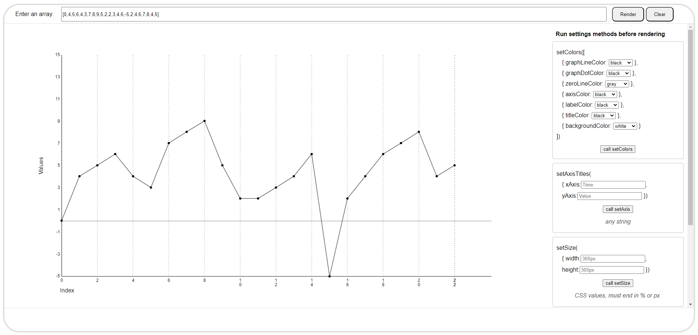

# jk224jv-graphdrawer-demopage

This is a demo page for the graphdrawer web component, found in the components/graphdrawer folder.
The graphdrawer is a web component that draws a graph from an array of numbers using the canvas element.

A live version of this demo page can be found at [https://graphdrawerdemo.netlify.app/](https://graphdrawerdemo.netlify.app/)

You can use this demo page as a starting point for your own project... in that case you can just clone this repo and start coding.
'It's my repo but you clone if you want to'... Im fairly sure that is what Abba sang.

Or you can get the stand-alone component [https://github.com/kodsmed/graphdrawer](https://github.com/kodsmed/graphdrawer)

## Usage

Clone the repo to your local machine.

Navigate to the root folder of the project and run `npm install` to install the dependencies.

The demo project comes pre-configured with vite, so you can run `npm run dev` to launch a local webbserver and preview the demo page.
The demo page is located in the src folder, and is called index.html.

## FOR FURTHER INFORMATION ABOUT HOW TO USE THE COMPONENT, SEE THE README.MD FILE IN THE COMPONENTS/GRAPHDRAWER FOLDER. OR THE COMPONENT SPECIFIC REPOSITORY

## License

MIT License, Jimmy Karlsson 2023, [LICENSE](LICENSE)
