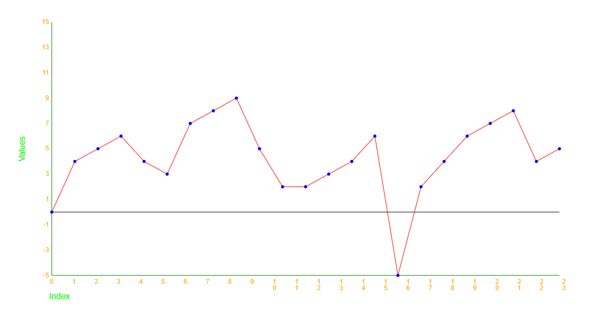

# Graphdrawer

Uses the canvas element to render an array of numerical data using the canvas element.
It also does some automatic scaling of the data to fit the canvas element,  
adapt the Y-axis to the range of the data, and the X-axis to the length of the data,  
and it will render the data as a graph with a graphline and dots at the data points.  
If zero is included in the data, it will also render a zero-line.

You can also change several settings, like colors, font, size, etc.  
All this are done by calling methods on the GraphDrawer element,  
no bulky attributes,  
no css, no complicated javascript calculations, height this and width that,  
just a simple method call.

## Dependencies

The component will work in any browser that supports the following:

* Custom Elements - [https://caniuse.com/custom-elementsv1](https://caniuse.com/custom-elementsv1)
* Shadow DOM - [https://caniuse.com/shadowdomv1](https://caniuse.com/shadowdomv1)
* Canvas API - [https://caniuse.com/canvas](https://caniuse.com/canvas)

## Demo

There is a demo application available at [https://github.com/kodsmed/graphdrawer-demopage](https://github.com/kodsmed/graphdrawer-demopage)

A live demo is available at [https://graphdrawerdemo.netlify.app/](https://graphdrawerdemo.netlify.app/)

## Usage

Copy the /components/graphdrawer folder into your project and import it into your code.
Public methods are documented in the jsdoc comments in the main graphdrawer.js file, as well in this readme.
If you are unsure how to use the custom elements and call its methods, see the example usage in the demo application.

## Testing

The automatic test suite is written in Jest for the jsdom test environment and can be run straight out of the repo with the command `npm run test`.
If you want to change the test environment, the test suit may need to be adapted.

If you want to run the test suite in your project, make sure to include the following scripts in your package.json:

```json
"scripts": {
    "test": "npx --node-options=--experimental-vm-modules jest || exit 0",
}
```

If you are not using the provided example file create a jest.config.js in the projects root-folder , and include the following:

```javascript
export default {
  testEnvironment: 'jsdom',
  moduleFileExtensions: ['js', 'mjs'],
  testMatch: ['**/test/**/*.test.js'],
  verbose: true,
  transform: {},
  resolver: null,
}
```

Make sure to also include the test dependencies in your projects package.json:

* jest
* jest-environment-jsdom

```json
  "devDependencies": {
    "jest": "^29.7.0",
    "jest-environment-jsdom": "^29.7.0"
  },
```

Install the dependencies with `npm install` and run the test suite with `npm run test`.

For manual testing see even numbered test reports.

## How to render?

Call the method "renderArrayAsGraph(number[])" on the GraphDrawer object. The array of numbers will be rendered as a graph.
The X axis will be the index of the array, the Y axis will be the value of the array at the given index.
The graph will be scaled to fit the canvas element.
The Y-axis will be scaled according to the range of the values in the array.

The X-axis will be scaled according to the length of the array.
The method will throw an error if it receives invalid values.
A maximum of 20 labels will be rendered on the X-axis.

example usage:

```javascript
const graphDrawer = document.querySelector('jk224jv-graphdrawer');
graphDrawer.render([1, 2, 3, 4, 5, 6, 7, 8, 9, 10]);
```

see the projects root-folder index.html and index.js files for a more complete example.

## How to change the colors?

Call the method "setColors([{graphLineColor: 'color'}, {graphDotColor: 'color'}, {zeroLineColor: 'color'}, {axisColor: 'color'}, {labelColor: 'color'}, {titleColor: 'color'}, {backgroundColor: 'color'}])" on the GraphDrawer element.
Objects not included in the array will be ignored, so you can set only the colors you want to change.
Order of the objects in the array is not important.
The method will throw an error if it receives invalid values.
Default values are: 'black' for everything except the zeroLineColor that is 'gray', and the backgroundColor that is 'white'.

Valid values are:

* 'red'
* 'green'
* 'lime'
* 'blue'
* 'yellow'
* 'orange'
* 'purple'
* 'black'
* 'gray'
* 'white'

example usage:

```javascript
const graphDrawer = document.querySelector('jk224jv-graphdrawer')
graphDrawer.setColors([{ graphLineColor: 'red' }, { graphDotColor: 'blue' }, { zeroLineColor: 'black' }, { axisColor: 'green' }, { labelColor: 'orange' }, { titleColor: 'lime' }, { backgroundColor: 'white' }])
```

```javascript
const graphDrawer = document.querySelector('jk224jv-graphdrawer')
graphDrawer.setColors([{ graphLineColor: 'red' }, { graphDotColor: 'blue' }, { zeroLineColor: 'black' }])
```



## How to change the size?

Call the method "setSize({width: 'cssValue', height: 'cssValue'})" on the GraphDrawer element.
Will throw an error if it receives invalid properties or values.
Must have both width and height properties, and they must be valid css values in px or % (ex. '500px', '50%').

example usage:

```javascript
const graphDrawer = document.querySelector('jk224jv-graphdrawer');
graphDrawer.setSize({ width: '500px', height: '500px' });
```

## How to change the axistitles?

Call the method "setAxisTitles({xAxis: 'string', yAxis: 'string'})" on the GraphDrawer element.
Will throw an error if it receives invalid properties or values.
Default values are "Value" for the Y-axis and "Index" for the X-axis.

example usage:

```javascript
const graphDrawer = document.querySelector('jk224jv-graphdrawer');
graphDrawer.setAxis({ xAxis: 'Time', yAxis: 'Value' });
```

```javascript
const graphDrawer = document.querySelector('jk224jv-graphdrawer');
graphDrawer.setAxis({ yAxis: 'Units' });
```

## How to change the font?

Call the method "setFontSettings({fontFamily: 'string', labelFontSize: 'number', titleFontSize:'number'})" on the GraphDrawer element.
Will throw an error if it receives invalid properties or values.

If you enter a font that is not installed on the users computer,
the browser will render the graph with a default font,
this is built in the browser and beyond the control of the component.

Default values for the component are "Arial" for the font, 12 for the labelFontSize and 16 for the titleFontSize.

example usage:

```javascript
const graphDrawer = document.querySelector('jk224jv-graphdrawer');
graphDrawer.setFont({ fontFamily: 'Arial', labelFontSize: 12, titleFontSize: 16 });
```

## How to change the size of the dots? Not Yet implemented

Call the method "setDataPointDotsSize(number)" on the GraphDrawer element.
The size of the dots must be a number 0 to 10. 0 means no dots will be rendered. Defaults to 3 pixels.

example usage:

```javascript
const graphDrawer = document.querySelector('jk224jv-graphdrawer');
graphDrawer.setDataPointDotsSize(5);
```

## How to clear the canvas?

Call the method "clear()" on the GraphDrawer element.

example usage:

```javascript
const graphDrawer = document.querySelector('jk224jv-graphdrawer');
graphDrawer.clear();
```

## Known bugs, limitations and open issues

### Bugs

* None known at this time.

### Limitations

* There is currently no handling of an array that contains more values than the canvas element can reasonably display. This will result in a graph that is too small to be useful. On a full-size screen, you can fit about 1000 values on the X-axis.
* Some of the setter methods are not yet implemented.

### Open issues

* I would like the graph to center on the graphline, so that the graphline medium is always in the middle of the canvas element. Currently the graphs minimum value is always at the bottom of the canvas element.
* Add the ability to select an algorithm for scaling the Y-axis, for example logarithmic scaling, x^2, etc.
* Add the ability to approximate the curve of the graph, for example with a bezier-curve, logarithmic, x^2.
* Add mouseover events to the graph, for example to display the value of the data point under the mouse.

## License

MIT License, Jimmy Karlsson 2023, [LICENSE](LICENSE)
