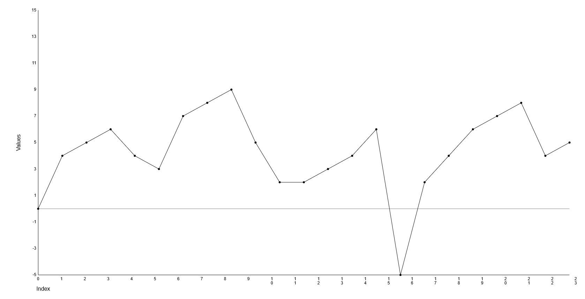
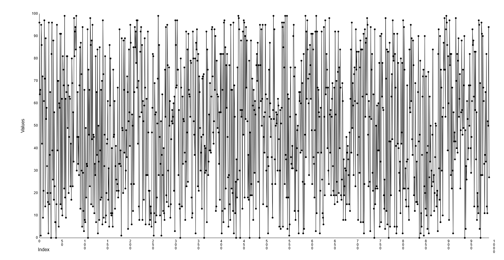
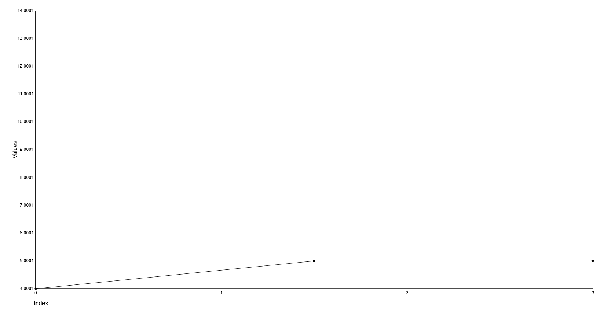
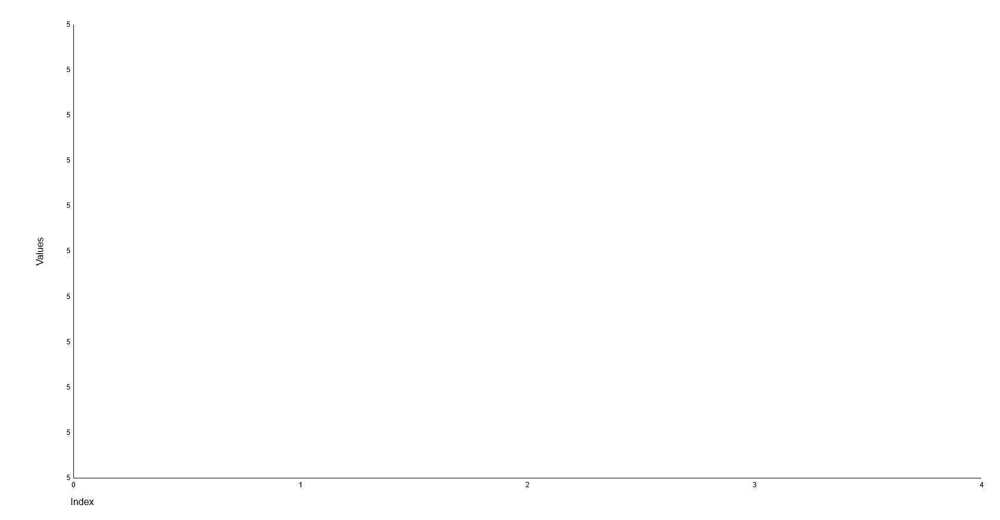

# Test report 2 - Manual test report

This is a test report for the GraphDrawer component and its included classes.
Before all tests, make sure the component appears correctly in the browser.

Test: Manual testing
Version: 1.0.0
Test Environment: Windows 11 22H2, Chrome 117, Node 20.6.0, NPM 9.8.1
Date: 2023-09-19
Tester: Jimmy Karlsson

## Test 1 - Render a graph with a valid dataset

### Test description

call the renderArrayAsGraph method with the array [0,4,5,6,4,3,7,8,9,5,2,2,3,4,6,-5,2,4,6,7,8,4,5]

### Expected output

The graph should be rendered correctly.


### Actual output

The graph was rendered correctly.

## Test 2 - Render a graph with a large dataset

### Test description

call the renderArrayAsGraph method with an array consisting of 1000 random numbers between 0 and 100.

```javascript
const overflowTestDataSet = []
for (let i = 0; i < 1000; i++) {
  overflowTestDataSet.push(Math.floor(Math.random() * 100))
}
```

### Expected output

The graph should be rendered correctly.


### Actual output

The graph was rendered correctly.

## Test 3 - Render a graph with a dataset with very small range

### Test description

call the renderArrayAsGraph method with the array [4.0001, 5, 5.0001]

### Expected output

The graph should be rendered correctly.


### Actual output

The graph was rendered correctly.

## Test 4 - Render a graph with a dataset with ZERO range

### Test description

call the renderArrayAsGraph method with the array [5, 5, 5]

### Expected output

The graph should be rendered correctly.

### Actual output

The graph was NOT rendered correctly, the Y-axis was not scaled correctly and the graph was thus rendered on the X-axis.


## Test 5 - Render a graph with all decimal numbers

### Test description

call the renderArrayAsGraph method with the array [1.1, 1.2, 1.5, 1.9, 1.15, 1.45]

### Expected output

The graph should be rendered correctly.

### Actual output

The graph was rendered correctly.

## Test Results

Tests 1-3, and 5 passed.
Test 4 failed.
